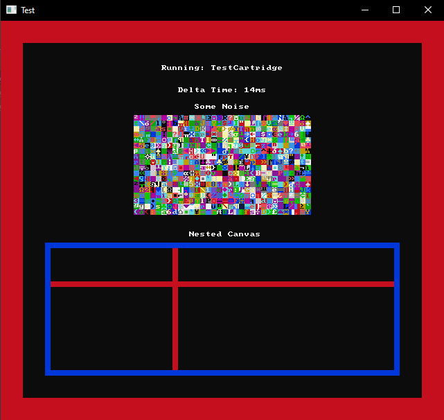

# ConsoleGameEnginePlusPlus

### Overview
This codebase is likely offensive to experienced C++ developers, my apologies for this XD.
I've not touched C++ since my eraly university days some 12 years ago. In that time I've mostly been using C#, so there's a bunch of stuff that has just completely left my brain.

In an attempt to brush off the cobwebs, and try to get a bit of practice into C++, I've decided to take an Idea I had done a while ago in C# and try to do the same thing in C++. That being a small Game Engine (more of a framework really) for running games in the console window. For this C++ approach I've decided to model it kind of like a little virtual console. There will be a fixed size screen, and you create your games as "cartridges" which the console will then run.

### Test Cart
In order to test some bits as they develop, the project contains a Test Cartridge whgich currently looks like this.

